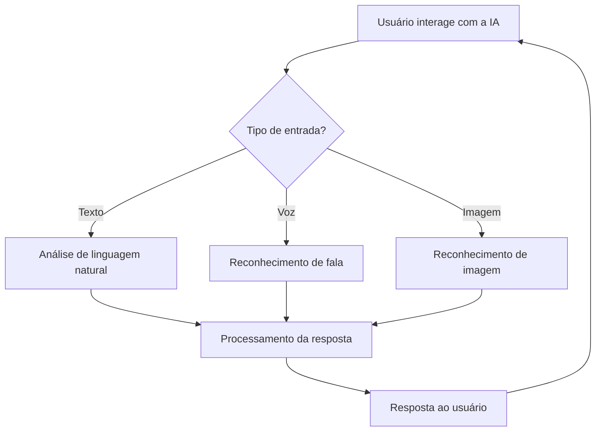

# 🌟 IA-Zenia

[](https://ia-zenia.netlify.app)
[](https://github.com/InacioDaniel/IA-Zenia)
[](LICENSE)

**IA-Zenia** é uma inteligência artificial interativa e adaptativa, criada para compreender **linguagem natural**, realizar **pesquisas online**, **reconhecimento de imagens** e interagir com o usuário de forma rápida e intuitiva.  

---

## 🎯 Funcionalidades Principais

| Funcionalidade | Status |
|----------------|--------|
| Compreensão de linguagem natural | ✅ |
| Suporte a gírias angolanas | ✅ |
| Pesquisa online integrada | ✅ |
| Reconhecimento de imagens | ✅ |
| Sistema de voz interativo | ✅ |
| Aprendizado offline | ✅ |
| Interface responsiva | ✅ |

---

## ⚙️ Fluxo de Funcionamento da IA



---

## 💻 Tecnologias Utilizadas

- **HTML5**, **CSS3**, **JavaScript** – Interface e lógica da IA.  
- **Netlify** – Hospedagem do site.  
- **Banco de dados local** – Armazena histórico e aprendizado offline.  
- **APIs de reconhecimento de imagem e voz** via JavaScript puro.  

---

## 🚀 Uso Rápido

1. Clone o repositório:

```bash
git clone https://github.com/InacioDaniel/IA-Zenia.git
```

2. Acesse a pasta do projeto:

```bash
cd IA-Zenia
```

3. Abra `index.html` no navegador ou hospede em um servidor local.  

4. Acesse o site oficial e interaja com a IA:  
[🌐 ia-zenia.netlify.app](https://ia-zenia.netlify.app)

---

## 🛠 Estrutura do Projeto

```
IA-Zenia/
│
├─ index.html       # Página principal
├─ style.css        # Estilos e tema visual
├─ zenia.js         # Lógica principal da IA
├─ logo.png         # Imagens padrão do zenia
├─ favicon.png      # logotipo e icone do zenia
└─ README.md        # Documentação completa
```

---

## 🤝 Contribuindo

1. Faça um fork do projeto.  
2. Crie sua branch:  
```bash
git checkout -b feature/nova-funcionalidade
```  
3. Faça commit das alterações:  
```bash
git commit -m 'Adicionar nova funcionalidade'
```  
4. Push para o branch:  
```bash
git push origin feature/nova-funcionalidade
```  
5. Abra um Pull Request.

---

## 📜 Licença

Licenciado sob **GPL License** – consulte o arquivo `LICENSE` para detalhes.

---

✨ **IA-Zenia** – Inteligência artificial **angolana, interativa e adaptativa**, pronta para evoluir com você!
